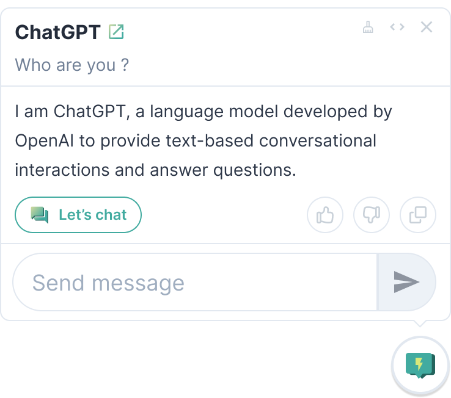

# LightTalk - Powered by ChatGPT API


LightTalk is a handy Chrome extension designed to harness the capabilities of OpenAI's ChatGPT, allowing users to ask questions to ChatGPT anywhere while browsing Chrome. By providing a simple and efficient interface, LightTalk enables quick inquiries to ChatGPT without the need for navigating away from the current browsing page.

## Features

1. **ChatGPT anywhere**: LightTalk allows you to interact with ChatGPT while browsing any page on Chrome. It eliminates the need to navigate away from the page you are working on.

2. **Fast and efficient**: With a user-friendly interface, LightTalk ensures efficient interaction with ChatGPT. A few clicks, and you get your answers right away.

3. **Intuitive design**: The UI of LightTalk has been designed to ensure ease of use and simplicity.

## Installation

1. Clone the repository to your local machine.

```bash
git clone https://github.com/yourusername/LightTalk.git
```

2. Navigate to Chrome extensions page `chrome://extensions/`

3. Enable Developer mode (switch at top right corner)

4. Click on "Load Unpacked" button (top left corner)

5. Select the cloned repository folder.

The LightTalk extension should now be visible in your Chrome extensions list.

## Usage

1. Click on the LightTalk icon in your Chrome extensions bar.

2. The LightTalk window will pop up on your current tab.

3. Setting your OpenAI API key or login to ChatGPT Web App.

4. Press the floating button, featuring the LightTalk icon, located at the bottom right corner of the screen.

5. Type in your question or query in the text box.

6. Click on the "Ask" button or press Enter.

7. ChatGPT will process your query and the response will appear in the conversation window.



## Privacy

LightTalk values your privacy. The extension does not store any personal data. All conversations with the ChatGPT are not recorded or saved.

## Contributing

Pull requests are welcome. For major changes, please open an issue first to discuss what you would like to change. Please make sure to update tests as appropriate.

## License

[MIT](https://choosealicense.com/licenses/mit/)

## Acknowledgments

- Thanks to [OpenAI](https://openai.com) for providing the ChatGPT API.

---

**Disclaimer**: LightTalk is not affiliated with, maintained, authorized, endorsed, or sponsored by OpenAI.